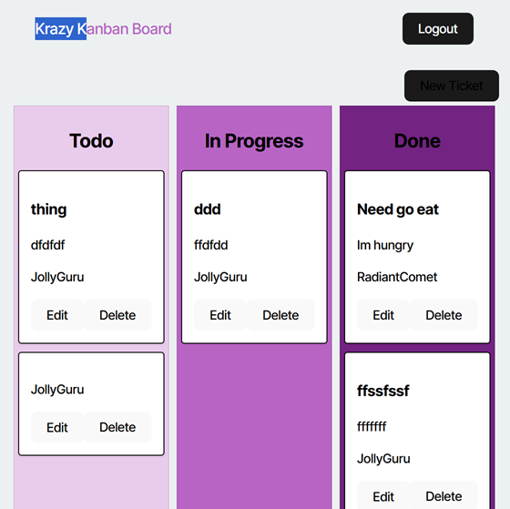

# Kanban_JWT_Application

## Description

This project is a user-friendly Kanban board application that enables users to create and edit tasks categorized under "To-Do," "In Progress," and "Done." Access to the task board requires users to log in with a username and password. Although all users share the same board, they have the ability to personalize their tasks.

The primary motivation behind this project was to gain hands-on experience in developing websites with JWT (JSON Web Tokens) for secure authentication. I highly recommend utilizing JWTs for anyone looking to implement a login feature to enhance the security of their website.

## Table of Contents

- [Installation](#installation)
- [Usage](#usage)
- [Credits](#credits)
- [License](#license)

## Installation

- Use this link [https://kanban-jwt-application.onrender.com](https://kanban-jwt-application.onrender.com) to get to deployed sit or if you want to use it on your own machine use following steps below. (Warning! the deployed website uses postgres for free on render which has expiration date.)
- copy either all the files from the repository to your computer or use your git bash terminal to clone the repository down to your own machine. 
- make sure you have [node js](https://nodejs.org/en) and the package manager that comes with it.
- run the following command in project folder terminal: npm install. This will download all the needed dependencies for the project.
- make sure you have a postgress you can access for project and set up the .env file and fill out all the variables.
- you will also want to run the npm run seed command before starting your project unless your database is empty.

## Usage

- After installing the project run in the terminal for the project: "npm run start:dev" (don't include the quotation marks). This will compile the type script files and start the project.
- The program some times will auto open the website in your browser but if not just put the following url in your browser: [http://localhost:3000/](http://localhost:3000/)
- once on the website you should see a prompt to login to create & view tickets for task that need to be done.
- click on the login button and it will take you to a login screen, fill out the username and password and click submit.
- if an invalid username or password is typed the login won't proceed further, but if you do put in info right it will take you to the ticket board.
- if you use the basic seed data with this project there will be three usernames JollyGuru, SunnyScribe, and RadiantComet all with the password "password". The deployed website has the same user's as well.
- once on the ticket board you can look at the task in the three diffrent categories: Todo, In Progress, & Done.

- click on the edit of the task and you can change the info of the ticket including its Name, which category its in, its desription of the task and the User that the task is for.
- once your done editing the ticket hit the submit button.
- The same menu can also be seen when you hit the make new ticket button, fill out the info and hit submit to make the new ticket.
- On any task you want to remove just hit the delete button and it will get removed the ticket from the board.
- If you dont have a token or token is expired after an hour and you go use the application to try and change the tickets it will kick you back to main screen.
- For a walkthrough of how to use the application [Click Here](https://drive.google.com/file/d/1_Awzyta_UUUFgwp2vH1bwi0a6hPdYTAp/view).

## Credits

Project Designer: Kalab Smith
- [K-Lab-Code](https://github.com/K-Lab-Code)
- [kalabsb@me.com](mailto:kalabsb@me.com)

## License

Distributed under the MIT License. See LICENSE.txt for more information.
